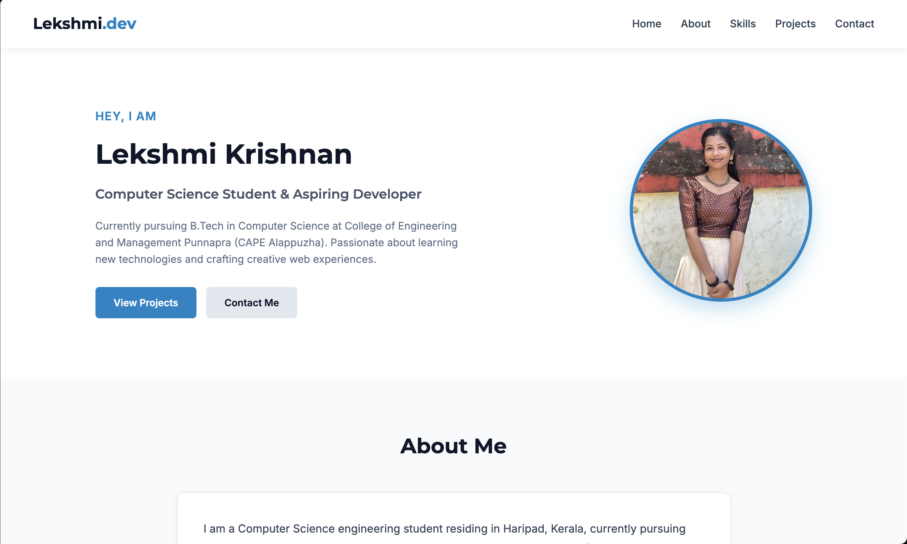

# Personal Portfolio - Lekshmi Krishnan

## Overview
- Task: Personal Portfolio (Task 2)
- Student: Lekshmi Krishnan
- Degree: B.Tech in Computer Science
- Institution: College of Engineering and Management Punnapra (CAPE Alappuzha)
- Location: Haripad, Kerala, India

## Preview

## Tech Stack
- HTML5
- CSS3 (Flexbox, Grid & Media Queries)
- Google Fonts (Montserrat & Inter)

## Features
- Fixed/sticky navbar with CSS hamburger menu for mobile devices
- Hero section with greeting, background text, CTAs, and circular profile picture
- About Me section highlighting computer science background and interests
- Technical Skills grid (HTML, CSS, JS, Python, C, Responsive Design, Git)
- Featured Projects section with cards and tech tags
- Contact section with LinkedIn profile link, location, and email details
- Smooth scroll navigation between sections

## File Structure
- `index.html` - HTML structure and portfolio sections
- `style.css` - Custom CSS styling and responsive layout
- `Screenshot-index.png` - Page preview screenshot
- `assets/` - Image directory containing profile photo (`profile.jpg`)
