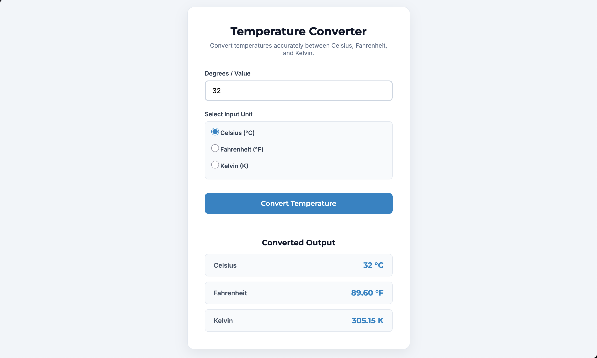

# Temperature Converter Website

## Overview
- Task: Temperature Converter Website (Task 3)
- Purpose: Converts temperatures between Celsius, Fahrenheit, and Kelvin in real-time.

## Preview

## Tech Stack
- HTML5
- CSS3 (Flexbox & Media Queries)
- JavaScript (Vanilla JS)
- Google Fonts (Montserrat & Inter)

## Formulas Used
- Celsius to Fahrenheit: `(C * 9/5) + 32`
- Celsius to Kelvin: `C + 273.15`
- Fahrenheit to Celsius: `(F - 32) * 5/9`
- Kelvin to Celsius: `K - 273.15`

## Features
- Numeric input validation rejecting non-numeric values
- Unit selection using radio buttons (Celsius / Fahrenheit / Kelvin)
- Simultaneous display of all output units (°C, °F, K)
- Absolute zero violation warnings (<-273.15°C, <-459.67°F, <0 K)
- Responsive centered UI card layout

## File Structure
- `index.html` - HTML form and layout structure
- `style.css` - Custom styling and layout
- `script.js` - Conversion logic and validation
- `Screenshot-image.png` - Preview screenshot
- `demo-video.mov` - Project walkthrough demo video
