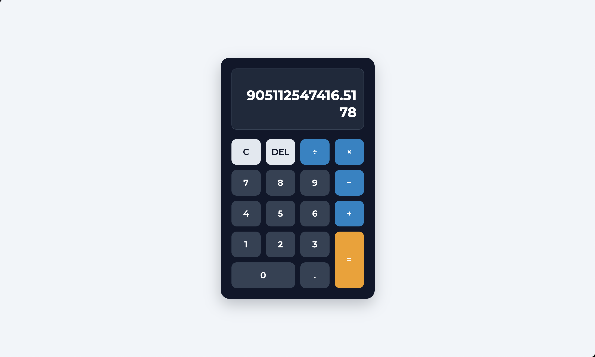

# Calculator Website

## Overview
- Task: Calculator (Level 2 - Task 1)
- Purpose: Fully functional browser-based calculator supporting arithmetic operations, operator chaining, and division-by-zero protection.

## Preview

## Tech Stack
- HTML5
- CSS3 (CSS Grid & Flexbox)
- JavaScript (Vanilla JS - No `eval()`)
- Google Fonts (Montserrat & Inter)

## Features
- Dual-line display showing current entry and operation history
- Number buttons (0–9) and decimal point (.)
- Arithmetic operations (+, −, ×, ÷)
- Clear (C) and Delete (DEL) actions
- Operator chaining for sequential calculations
- Division-by-zero protection displaying `"Error: Division by 0"`
- Button alignment built using CSS Grid
- Keyboard support for number and operator input
- Event listeners attached dynamically without inline `onclick` attributes

## File Structure
- `index.html` - Calculator structure and button layout
- `style.css` - CSS Grid styling and theme
- `script.js` - Calculation engine and event handling
- `Screenshot-image.png` - Preview screenshot
