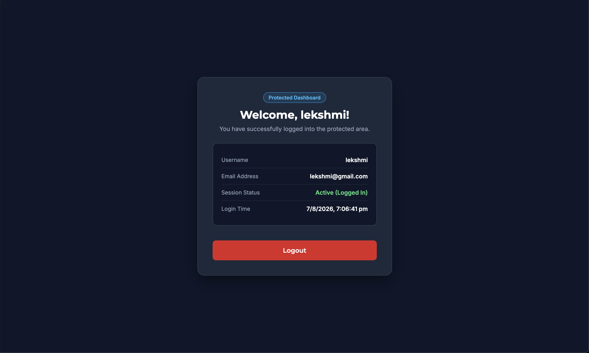

# Login Authentication System

## Overview
- Task: Login Authentication System (Level 2 - Task 4)
- Approach: Client-side authentication using HTML5, CSS3, Vanilla JavaScript, SHA-256 Hashing, and `localStorage`.

## Preview

## Tech Stack
- HTML5
- CSS3 (Flexbox & Media Queries)
- JavaScript (Vanilla JS & Web Crypto API)
- Google Fonts (Montserrat & Inter)

## Features
- **User Registration**: Username, Email, and Password registration form
- **Password Security**: Passwords hashed with SHA-256 Web Crypto API (`crypto.subtle.digest`) before storage in `localStorage`
- **Password Validation**: Requires minimum 8 characters and at least 1 numeric digit
- **Duplicate Prevention**: Checks for pre-existing username or email in `localStorage` database
- **User Login**: Username/Email and password authentication
- **Generic Error Handling**: Displays `"Invalid username/email or password"` to prevent account enumeration
- **Protected Dashboard**: Restricts access to authenticated sessions, displaying user details and login time
- **Session Management**: Session persistence across page reloads and Logout button clearing session
- **Responsive Card UI**: Dark glassmorphic design adapting to mobile and desktop viewports

## File Structure
- `index.html` - App structure with login, register, and protected dashboard views
- `style.css` - Custom styling, view transitions, and layout
- `script.js` - SHA-256 hashing, authentication logic, routing, and `localStorage` integration
- `Screenshot-image.png` - Preview screenshot
- `demo-video.mov` - Project walkthrough demo video
