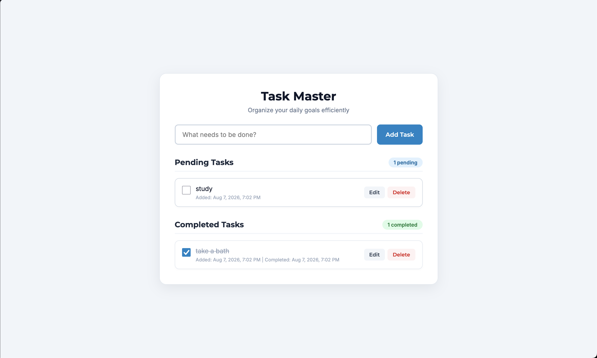

# To-Do Web App

## Overview
- Task: To-Do Web App (Level 2 - Task 3)
- Purpose: Interactive task management tool to add, complete, edit, delete, and persist daily tasks.

## Preview

## Tech Stack
- HTML5
- CSS3 (Flexbox & Media Queries)
- JavaScript (Vanilla JS & `localStorage`)
- Google Fonts (Montserrat & Inter)

## Features
- Task creation input with validation
- Separate Pending and Completed task lists
- Mark Complete toggle to move tasks between lists
- Inline task editing with Save/Cancel support
- Permanent task deletion from either list
- Dynamic task count badges ("X pending" and "Y completed")
- Created and Completed timestamps on each task
- Automatic data persistence across page refreshes using `localStorage`
- Friendly empty state messages for empty lists
- Responsive container design for mobile and desktop screens

## File Structure
- `index.html` - App structure and task list containers
- `style.css` - Custom styling, badges, and layout
- `script.js` - Task state management, DOM rendering, and `localStorage` integration
- `Screenshot-image.png` - Preview screenshot
