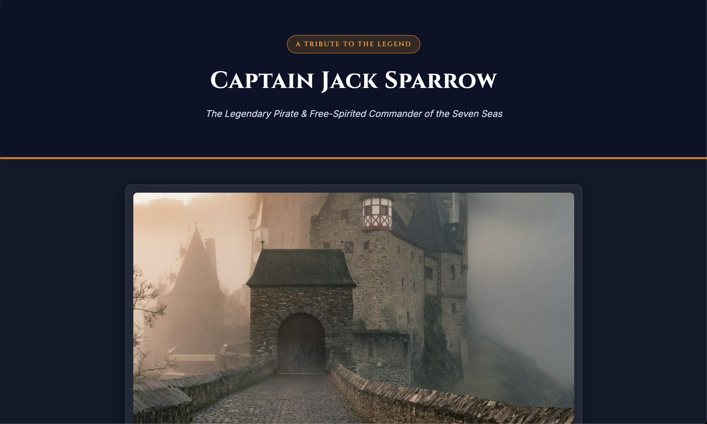

# Tribute Page - Captain Jack Sparrow

## Overview
- Task: Tribute Page (Level 2 - Task 2)
- Subject: Captain Jack Sparrow (Pirates of the Caribbean)

## Preview

## Tech Stack
- HTML5
- CSS3 (Flexbox & Media Queries)
- Google Fonts (Cinzel & Inter)

## Features
- Page header with title and tagline
- Prominent hero image with quote caption
- Biography section featuring 4 detailed paragraphs
- Notable quote block with distinct styling
- Interactive timeline cards detailing key voyages and achievements
- Dual typography (Cinzel serif for headings, Inter sans-serif for body)
- Multiple distinct background colors across sections (#0b1329, #faf7f2, #2d1b0e, #1e293b)
- Responsive layout for mobile and desktop viewports

## File Structure
- `index.html` - Page content and structure
- `style.css` - Custom styling and layout
- `Screenshot-image.png` - Preview screenshot
- `demo-video.mov` - Project walkthrough demo video
